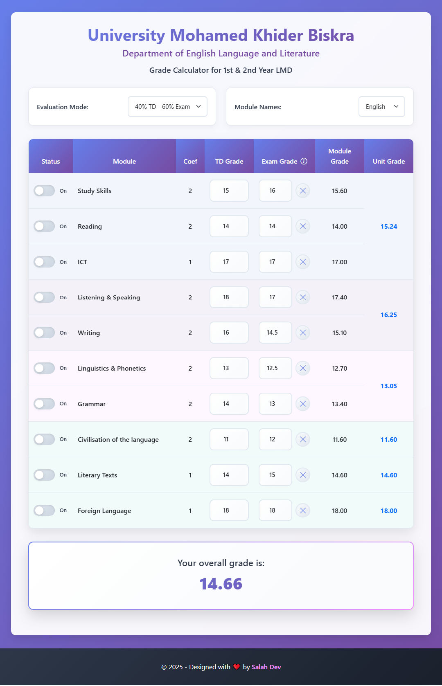

# English Grade Calculator for 1st & 2nd Year LMD

A simple and user-friendly web page to calculate grades for first and second year LMD students in the Department of English Language and Literature at the University of Mohamed Khider Biskra. This tool helps students calculate their overall grade based on TD and exam scores.

**Live Demo:** [https://salahdev25.github.io/english-grade-calculator/](https://salahdev25.github.io/english-grade-calculator/)

---

## Features

- **Grade Calculation**: Calculate your overall grade based on TD and exam scores.
- **Evaluation Mode**: Choose between two options:
  - 40% TD - 60% Exam
  - 50% TD - 50% Exam
- **Language Support**: Switch between English and French for module names.
- **Exclude Modules**: Easily exclude modules you haven’t studied.
- **Responsive Design**: Works seamlessly on both desktop and mobile devices.

---

## Screenshot

---

## Contact

- **Salah Dev**  
  - Telegram: [@SalahDev](https://t.me/SalahDev)
  - GitHub: [salahdev25](https://github.com/salahdev25)

- If you find this tool helpful, please give it a ⭐ on GitHub! 😊

---
